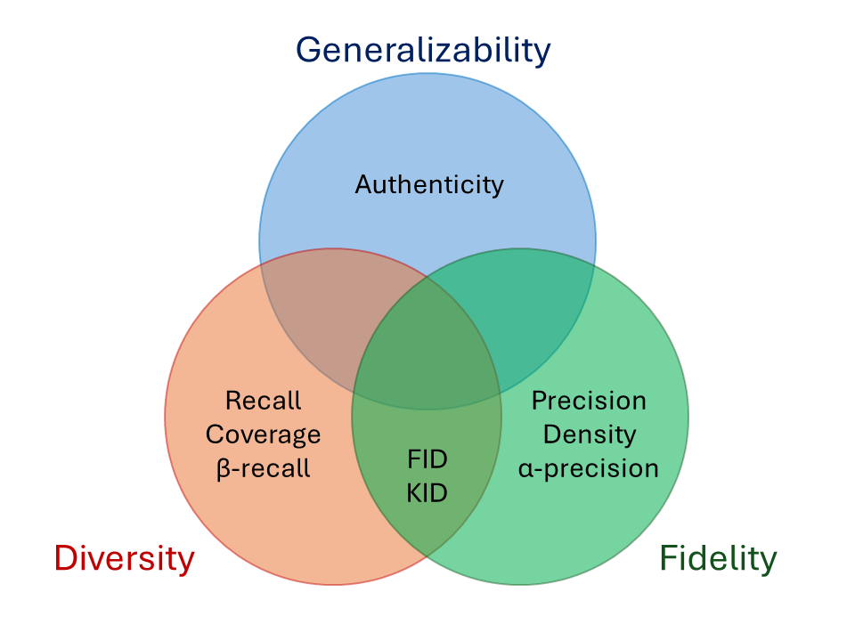

 

# Synthetic_Images_Metrics_Toolkit

This repository contains a collection of the state-of-the-art metrics used to evaluate the quality of synthetic images. 

The metrics in this repository allows for the evaluation of fidelity (realness of synthetic data), diversity (coverage of real data distribution), and generalizability (generation of authentic, non-memorized images). 

## Licenses
This repository follows the [REUSE Specification](https://reuse.software/). All source files are annotated with SPDX license identifiers, and full license texts are included in the `LICENSES` directory.

### Licenses Used

1. **LicenseRef-NVIDIA-1.0**: Applies to code reused from NVIDIA's StyleGAN2 repository: https://github.com/NVlabs/stylegan2-ada-pytorch.
2. **MIT**:  For code reused from :
    - https://github.com/vanderschaarlab/evaluating-generative-models; 
    - https://github.com/clovaai/generative-evaluation-prdc.
3. **NPOSL-3.0**: Applies to the code developed specifically for this repository.

For detailed license texts, see the `LICENSES` directory.

## Installation
🚧 Work in progress...

## Usage
🚧 Work in progress...

## Quantitative metrics
🚧 Work in progress...

| Metric        | Description | Original implementation |
| :-----        | :-----: | :---------- |
| `fid50k_full` | Fr&eacute;chet inception distance[1] against the full dataset | https://github.com/NVlabs/stylegan2-ada-pytorch
| `kid50k_full` | Kernel inception distance[2] against the full dataset | https://github.com/NVlabs/stylegan2-ada-pytorch
| `pr50k3_full` | Precision and recall[3] againt the full dataset |  https://github.com/NVlabs/stylegan2-ada-pytorch
| `is50k`       | Inception score[4] for CIFAR-10 |  https://github.com/NVlabs/stylegan2-ada-pytorch
| `ppl2_wend`   |  Perceptual path length[5] in W, endpoints, full image |  https://github.com/NVlabs/stylegan2-ada-pytorch
| `ppl_zfull`   |  Perceptual path length in Z, full paths, cropped image |  https://github.com/NVlabs/stylegan2-ada-pytorch
| `ppl_wfull`   |  Perceptual path length in W, full paths, cropped image |  https://github.com/NVlabs/stylegan2-ada-pytorch
| `ppl_zend`    | Perceptual path length in Z, endpoints, cropped image |  https://github.com/NVlabs/stylegan2-ada-pytorch
| `ppl_wend`    |  Perceptual path length in W, endpoints, cropped image |  https://github.com/NVlabs/stylegan2-ada-pytorch
| `prdc`    |  Precision, recall, density, and coverage[6]|  https://github.com/clovaai/generative-evaluation-prdc
| `pr_auth`    |  	$\alpha$-precision, 	$\beta$-recall, and authenticity[7]|  https://github.com/vanderschaarlab/evaluating-generative-models

References:
1. [GANs Trained by a Two Time-Scale Update Rule Converge to a Local Nash Equilibrium](https://arxiv.org/abs/1706.08500), Heusel et al. 2017
2. [Demystifying MMD GANs](https://arxiv.org/abs/1801.01401), Bi&nacute;kowski et al. 2018
3. [Improved Precision and Recall Metric for Assessing Generative Models](https://arxiv.org/abs/1904.06991), Kynk&auml;&auml;nniemi et al. 2019
4. [Improved Techniques for Training GANs](https://arxiv.org/abs/1606.03498), Salimans et al. 2016
5. [A Style-Based Generator Architecture for Generative Adversarial Networks](https://arxiv.org/abs/1812.04948), Karras et al. 2018
6. [Reliable Fidelity and Diversity Metrics for Generative Models](https://proceedings.mlr.press/v119/naeem20a/naeem20a.pdf), Naeem et al., 2020
7. [How Faithful is your Synthetic Data?
Sample-level Metrics for Evaluating and Auditing Generative Models](https://proceedings.mlr.press/v162/alaa22a/alaa22a.pdf), Alaa et al., 2022

## Qualitative metrics
🚧 Work in progress...

